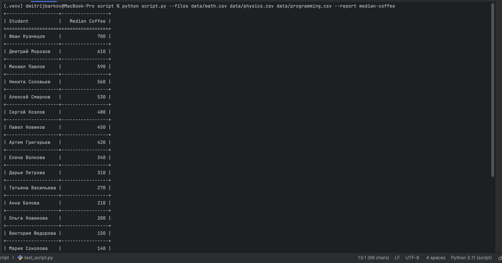

# CSV Report Script

The script accepts CSV files, reads them, and calculates the median coffee spent per student. Outputs results to the terminal as a table.

## Installation
```bash
git clone https://github.com/kit-kosatka/csv-report
pip install -r requirements.txt
```

## Usage
```bash
python script.py --files data/math.csv data/physics.csv data/programming.csv --report median-coffee
```

## Available reports

- `median-coffee` — median coffee spent per student, sorted by descending

## Example



## Tests
```bash
pytest test_script.py
```